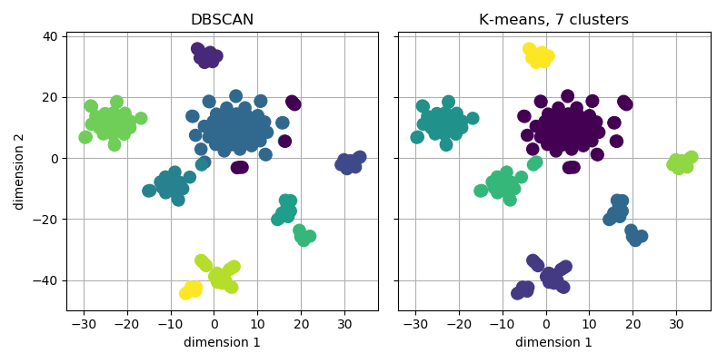

Example: Classification of cell populations
===========================================
A typical application of scRNA-Seq is classification of cell populations in a heterogeneous tissue. In this example, ~200 Peripheral Mononuclear Blood Cells (PBMCs) are classified using feature selection, dimensionality reduction, and unsupervised clustering.

.. code-block:: python

    import matplotlib.pyplot as plt
    from singlet.dataset import Dataset

    ds = Dataset(counts_table='example_PBMC')

    # Normalize
    ds.counts.normalize(method='counts_per_million', inplace=True)
    ds.counts.log(inplace=True)

    # Select features
    ds.feature_selection.expressed(n_samples=3, exp_min=1, inplace=True)
    ds.feature_selection.overdispersed_strata(
            n_features_per_stratum=20,
            inplace=True)

    # Reduce dimensionality
    vs = ds.dimensionality.tsne(
            n_dims=2,
            theta=0.5,
            perplexity=0.8)

    # Reset the counts with the reduced values
    ds.counts = vs.T

    # Cluster
    ds.samplesheet['dbscan'] = ds.cluster.dbscan(eps=5, axis='samples')
    ds.samplesheet['kmeans'] = ds.cluster.kmeans(n_clusters=7, axis='samples')

    # Plot t-SNE
    fig, axs = plt.subplots(
            nrows=1, ncols=2, sharex=True, sharey=True,
            figsize=(8, 4))
    ds.plot.scatter_reduced_samples(vs, color_by='dbscan', ax=axs[0], zorder=10)
    ds.plot.scatter_reduced_samples(vs, color_by='kmeans', ax=axs[1], zorder=10)

    axs[0].set_title('DBSCAN')
    axs[1].set_title('K-means, 7 clusters')

    plt.tight_layout()
    plt.show()

You should get figures similar to the following one:

