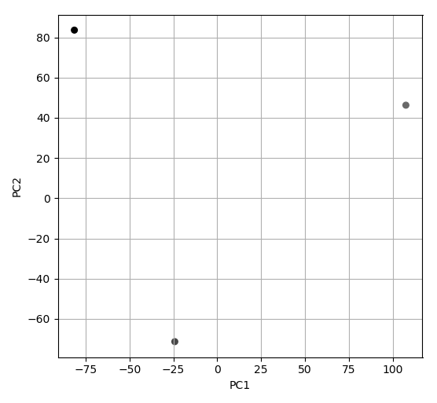

Example: Principal Component Analysis
=====================================
Principal Component Analysis (PCA) is a popular dimensionality reduction method. Because outlier samples can strongly affect the results of PCA, `singlet` also implements a robust PCA version via Principal Component Pursuit (cite).

.. code-block:: python

  from singlet.dataset import Dataset
  ds = Dataset(
          samplesheet='example_sheet_tsv',
          counts_table='example_table_tsv')

  ds.counts.normalize('counts_per_million', inplace=True)
  ds.counts = ds.counts.iloc[:200]

  print('Calculate PCA')
  vs = ds.dimensionality.pca(
          n_dims=2,
          transform='log10',
          robust=False)['vs']

  print('Plot PCA')
  ax = ds.plot.scatter_reduced_samples(
          vs,
          color_by='ACTB')

  plt.show()

You should get figures similar to the following ones:

